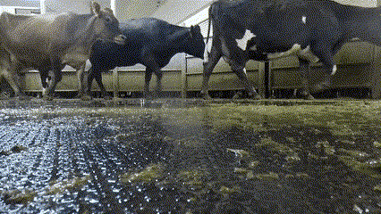
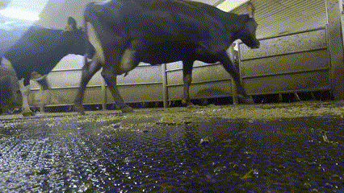
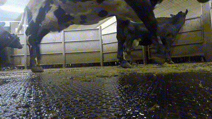
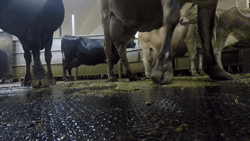
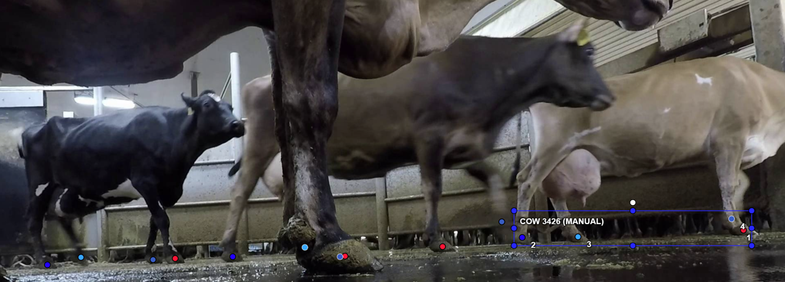
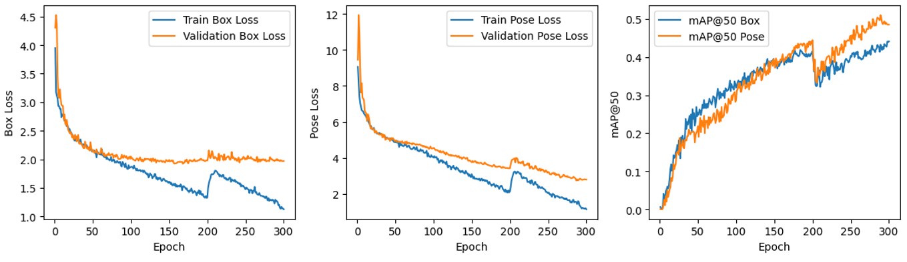
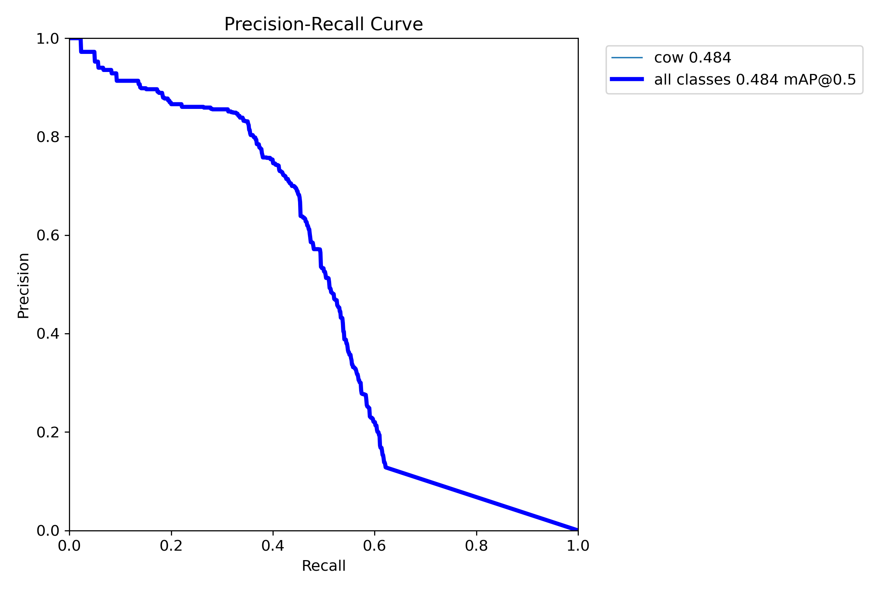
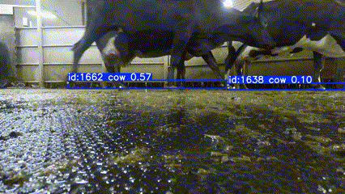
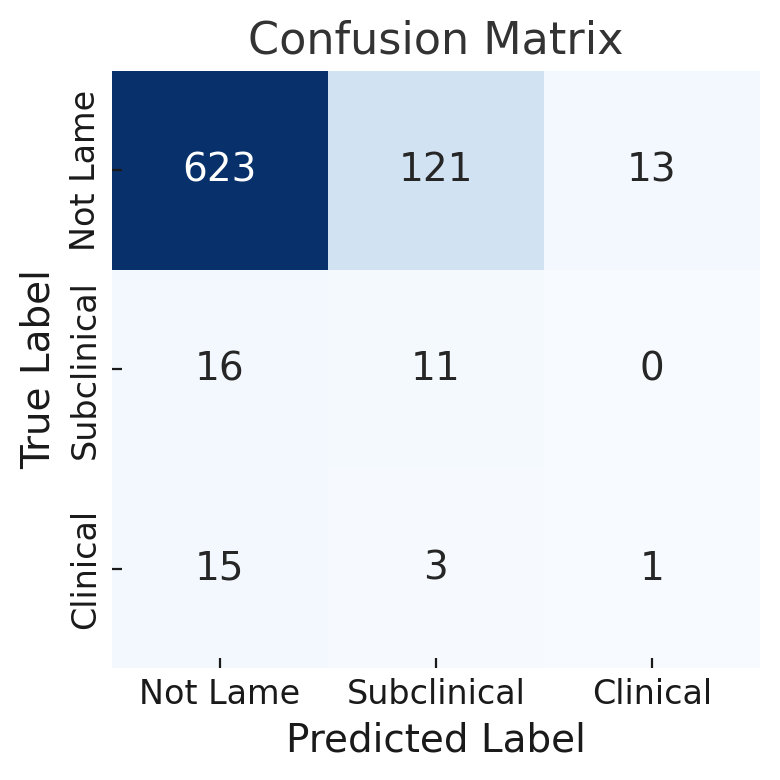

# Automatic Lameness Detection in Complex Multi-Cow Scenes

<h4>By Moniek Smink, Pratham Johari, and Talitha Aarnoutse (TU-Delft) in collaboration with the University of Wisconsin-Madison School of Veterinary Medicine.</h4>

# Background & Motivation

Cattle husbandry, or the raising of cattle to produce diversified products for consumption, is a huge worldwide industry. The US alone houses more than 89 million cattle, creating an income of more than $80 billion every year1. 

After reproduction and mastitis issues, the third most import dairy production health problem is cattle lameness, seen as abnormal movement and/or extreme posture, such as limping, abnormal headbobbing, or back arching2. Lameness is a sign of pain or discomfort within the locomotor system of the animal and is often caused by bacterial infection or improper hoof trimming. Lameness is measured in different ways, including 3, 4, and 9 point scales. For the purposes of this report, we separate two types of cattle lameness: 

1. Clinical Lameness: when the animal is noticeably lame.
2. Subclinical Lameness: when the animal's lameness is subtle.

Please see examples of a clinical and subclinical animal in Figure 1. 

<h5>Figure 1: Examples of a clinically lame cow (left image; first cow: brown) and a subclinically lame cow (right image; third cow: brown).</h5>

 

Lameness is a huge issue, impacting around 21% of all the world's cattle3. If left untreated, lameness is extremely painful and has severe impacts on the health and welfare of a cow. It also is a severe detriment to a farm's production, significantly lowering milk yields3. Lameness is often a sign of infection, which, if left untreated, can cause extremely high somatic cell counts (antibody cell counts) in the milk of a cow, also decreasing the quality of the milk. This is a multi-billion $/€ issue affecting hundreds of millions of animals and farmers.

What also makes cattle lameness such a significant issue is how challenging it is to manage. Clinical cases are easier to identify but are not always treatable3. Subclinical cases are almost always cheaply treatable, but are extremely difficult for untrained eyes to identify3. Ideally, a farmer would want to identify lameness in the subclinical stage because of the easier and cheaper treatment. On huge farms with thousands of cattle, spotting these subclinical cases early is incredibly difficult.

Thus, the cattle husbandry industry has turned to computer vision as a potential solution to automatically detect lameness in cattle. These systems must be portable to real-world environments, meaning that they must function with limited computational resources, without wifi, and in dirty environments. Furthermore, these systems must operate in close to real-time because, on thousand cow dairies, a system will not have time to process a backlog of footage before a new batch of cows arrive.

### Related Work

Several approaches exist, commercially and in the research community, that automatically detect lameness in cattle, but these approaches are often sensitive to inter- and intra- animal variability, such as breed of cow, color of cow, and environmental factors 4,5,6. Furthermore, these systems, as far as we are aware, are always for clean, single-cow scenes, where one cow smoothly walks across the frames without human interference. Open-source approaches are usually created and evaluated in small farm environments with less than 200 cows. Thus, these approaches generalize poorly to huge farm environments where cows display typical cow behavior with and without human interference. Examples of these complex multi-cow scenes can be seen in Figure 2.

<h5>Figure 2: Examples of a complex multi-cow scenes: with human interference (left), with severe occlusion (all), and with typical cow behavior (right).</h5>

  

Finally, none of the open-source approaches for automatic lameness detection use more advanced computer vision techniques such as end-to-end video action recognition 7, or skeletal action recognition4,5,6, although other tasks such as cattle behavior recognition have explored such methods 10. Existing approaches often employ a three stage approach. First, they localize the animal using foot detection, cow pose estimation, or cow segmentation with methods such as Faster-RCNN, T-LEAP, and Mask-RCNN. They then calculate hand-made features such as step length, head bob, and back arch coefficients. Finally they classify based on traditional discriminative classifiers such as support vector machines (SVMs), logistic regression, or decision trees4,5,6.

A classic end-to-end video action recognition method leveraged in this report is Inflated 3D networks (I3D). I3D is a two stream 3D convolutional neural network (CNN) that uses both RGB and optical flow frame inputs to classify human actions such as kicking and punching in videos7. When doing multi-stage video action recognition, localization of important features can be done using pose estimation models11,13, which extract keypoints from video frames, and tracking layers12,14, which assign these keypoints to individuals over time. After localizing the important features over time, classification can be done using different spatiotemporal methods. First, the temporal component needed to identify lameness makes attention mechanisms and RNN mechanisms14 particularly promising, as both of these methods have ways to combine temporal contexts to reason over time. Although not fully explored in this report, typical skeletal action recognition methods include spatial temporal graph convolutional networks (ST-GCNs) 8 and Pose C3Ds9 which process spatiotemporal features using graph convolutions and 3D heatmap convolutions, respectively, to classify actions in videos.

### Research Questions & Contributions

We aim to explore automatic lameness detection in complex, multi-cow scenes (shown in Figure 2) using more recent computer vision methods than existing approaches. Our research questions include:

1. How does an existing computer vision technique, such as end-to-end video action recognition, perform in a difficult task such as multi-cow lameness detection?
2. How can an automatic lameness detection system be made robust to inter- and intra- animal variability in a large production environment, while still being portable and efficient?

In our efforts, we contribute a new multi-purpose dataset, privately available, for complex, multi-cow scenes. We deliberate existing video action recognition methods' capabilities on this dataset. And, we propose a real-time two-stage lameness detection pipeline moving towards classifying lameness in complex, multi-cow scenes.

# Methods

## The Data

To answer our research questions, it was clear that we would need the help of experienced professionals, not only to get access to complex, multi-cow scene videos, but also to help verify lameness labels. Associate Professor and veterinarian at UW-Madison's School of Veterinary Medicine, Dr. Dörte Döpfer recorded more than six hours of footage and graciously allowed us access to it with the agreement that this data was highly private and any resulting labeling or work would be under her supervision, but we would be credited. The six hours of footage were recorded with informed consent using GoPro cameras at a private midwestern dairy with more than 9 thousand cows of varying ages, breeds, and colorings. 

The data was annotated by us in three different ways to be used in three different methods. Labels related to lameness were verified by Dr. Döpfer.

## Experiments

## 1. End-to-End Video Action Recognition

To the best of our knowledge, no one in existing literature has tried end-to-end video action recognition (VAR) on cattle lameness recognition, but there are parallels between the two tasks. Thus, we decided to explore this.

### Data Annotation

Subsets of the source footage were randomly selected for processing and were split into five second clips. These clips were then either pseudo labeled by us and then verified by Dr. Döpfer, or directly labeled by Dr. Döpfer without our assistance. This yielded 1,015 clips with a 'Not Lame' (78.23%), 'Subclinically Lame' (13.69%), or 'Clinically Lame' (8.08%) label. It was decided that if there was a single cow in the clip that was lame, the whole clip would be labeled as such, with a worst label priority rule. These clips were then split into train (80%), validation (10%), and test (10%) sets to be used to train and evaluate our VAR models. Since the distribution of the different labels was significantly unbalanced, a balanced version of the training dataset was also created where the two lame labels were oversampled to form a label distribution of 38.63%, 36.10%, and 25.27%. The 'Not Lame' label was not undersampled to still allow the model to learn animal variability.

### Model & Intermediate Results

For this experiment, we leveraged I3D7, a standard VAR model pretrained on Kinetics-400 which takes 32 224x224 frames as input. We finetuned the model for 10 epochs using stochastic gradient descent with random cropping and horizontal flipping on the unbalanced and balanced datasets described above. 

## 2. Multi-Cow Localization + Classification

In order to abstract away scene variabilities such as coloring, behavior, occlusion, and surroundings, we also leveraged a two step approach. We first localize and track important features of a cow over time and then, based on that sequence of tracked features, predict lameness for that localized cow.

### Pose Estimation + Tracking

We first localize a cow using pose estimation with keypoints. This step removes any extraneous information about the surroundings of the cow. Then, we track these important features across the input frames, allowing the downstream classification model to learn fine-grained temporal relationships between the features to classify lameness.

#### Data Annotation

We randomly select 1,015 frames from our source footage and label four keypoints with optional occlusion or out-of-frame flags per cow present in the frame using CVAT. The four keypoints we chose to label were the four feet: right front, right rear, left rear, and left front. We chose this keypoint schema to deal with occlusion and make processing more efficient. Previous 10-point or 17-point cattle keypoint schemas would flood the classification model with potentially unecessary keypoints that are not usually available in multi-cow scenes. This would make our keypoint model and the downstream classification model more unstable and inefficient, thus we decided to only use the four feet keypoints. An example frame labeled by us along with the mentioned 10 and 17-point previous keypoint schemas are shown in Figure 3.

<h5>Figure 3: Example frame of our multi-cow keypoint labeling (left) and the 10-point (middle) and 17-point (right) cow keypoint schemas proposed in previous works.</h5>

 

After removing frames with no animals present, 972 keypoint frames were then split into train and validation sets with an 80-20 split.

#### Models

##### YoloV8L-Pose

In order to accomplish multi-object pose estimation, we leveraged the YoloV8-Large-Pose model11 which takes a 640x640 frame and returns keypoints for each detected object using a customized backbone, PAN-FPN neck, and pose estimation prediction head. A multi-part loss function is used that combines complete Intersection over Union (IoU) loss, two Binary Cross-Entropy (BCE) losses, and MSE loss for its various outputs including bouding boxes, class/objectness scores, and keypoints. We chose to use the Yolov8L-Pose model because of its competitive performance, extremely fast inference on edge devices, and ease of use. 

Our YoloV8L-Pose model was finetuned on our keypoint dataset for 300 epochs, split into two training runs for 200 epochs, and another for 100 epochs when we saw that pose validation loss had not yet converged.

##### BoT-SORT

On top of the yolo model, we used a multi-object tracking algorithm called BoT-SORT12 to try to automatically assign a tracking id (tID) to each cow over a video. BoT-SORT is an advanced algorithm that combines appearance features, motion prediction using Kalman filtering, history-detection matching using the Hungarian algorithm, and camera motion compensation tricks. We chose this particular tracking layer because of its robustness to occlusion and real-time inference.

### Lameness Classification

After localizing the feet over time, a lameness classifier needs to take these sequences of keypoint locations and determine the lameness label.

#### Data Annotation

In order to obtain sequences of keypoints over time with lameness labels, we took our 1,015 labeled clips from the VAR experiments and performed inference using our YoloV8L-Pose/BoT-SORT pipeline. Each clip now had a set of tracking ids (tIDs). Each tID had a list of the keypoints found in each frame for that tID. We filtered any tID with less than 20 frames, because, at 30 FPS, 20 frames would be less than a single step of a cow. Furthermore, Dr. Döpfer filtered out 43 clips where lameness scoring was impossible due to cow crowds or human interference. This left a total of 7,897 sequences of keypoints over the clips. We then went back through every clip to match each tID to the vet-confirmed label. This dataset was then split into train (80%), validation (10%), and test (10%) sets. This dataset was unbalanced, with around 95%, 3%, and 2% of the samples being in the 'Not Lame', 'Subclinically Lame', and 'Clinically Lame' classes, respectively. The test set contained continuous tIDs from the same clips to enable qualitative analysis of whole clips.

#### Model Selection

With the goal of creating real-time pipeine, we decided to first try very simple architectures for lameness classification, namely RNNs, as a baseline. Two simple RNNs were trained:

1. Two-layer GRU with single linear layer
2. Three-layer bidirectional-LSTM with two linear layers for each sequence direction

To try to mitigate the extreme data imbalance, the Cross Entropy Loss was weighted according to the class distribution, yielding weights of 1/95, 1/3, and 1/2 for the 'Not Lame', 'Subclincially Lame', and 'Clinically Lame' samples, respectively. The models were trained for 600 epochs while saving at epochs with the highest macro-F1 score on the validation set.

### Other Tried Methods

## Results & Discussion

### End-to-End Video Action Recognition Model

The top1 accuracy and average top1 accuracy of the I3D model on the raw and balanced VAR dataset is shown in Table 1.

<h5>Table 1: Top1 accuracy and average top1 accuracy of all classes of the finetuned I3D model on our custom cattle lameness dataset.</h5>

| Dataset   | Top1 Accuracy† | Mean Class Top1 Accuracy  |
|-----------|------------|-----------------------|
| Raw       | 71.28      | 37.41                 |
| Balanced  | 47.52      | 42.42                 |

<h6>† Top1 Accuracy refers to the percentage of samples for which the top predicted class is the correct label.</h6>

We see that end-to-end VAR has trouble with spotting lameness. I3D is pretrained on human actions which are often obvious from a single frame or a few frames. However, fine-grained temporal relationships are necessary to identify lameness, which I3D's frame sampling strategy doesn't adequately achieve. Furthermore, I3D must learn to be robust to scene variability such as cow positions, colorings, and occlusion. We don't have enough data to teach an I3D model how to recognize lameness while being robust to scene variabilities. This further justifies our decision to explore two-stage approaches that abstract away the scene variabilities and focus on the important temporal information.

### Two-Stage Lameness Detection Pipeline

#### Localization/Tracking

The training curves and final pose precision-recall curve of the YoloV8L-Pose pose estimation model can be seen in Figure 4. The final mean Average Precisions (mAPs) for both detection and pose estimation can be seen in Table 2. Due to our limited time, we were not able to quantitatively evaluate the BoT-SORT tracking algorithm, but an overall qualitative example of how the final pipeline functioned can be seen in Figure 6.

<h5>Figure 4: Training curves (top) and pose Precision-Recall curve (bottom) of the YoloV8L-Pose model on our multi-cow keypoint dataset.</h5>

<h5>Table 2: Mean Average Precisions (mAPs) for different Intersection-over-Union (IoU) thresholds for the final YoloV8L-Pose model trained on our multi-cow keypoint dataset.</h5>

| Type of Prediction   | mAP@0.5† | mAP@0.5:0.95*  |
|-----------|------------|-----------------------|
| Pose       | 48.49      | 31.96                 |
| Box  | 43.92      | 19.64                 |

<h6>† mAP@0.5: Mean Average Precision at IoU threshold of 0.5. Indicates how well the model detects objects/keypoints with a reasonable overlap. 
* mAP@0.5:0.95: Mean Average Precision averaged over IoU thresholds from 0.5 to 0.95 (in steps of 0.05). A more stringent and comprehensive metric for model performance.</h6>

<h5>Figure 6: Example YoloV8L-pose keypoint estimation and BoT-SORT tracking, seen in 'id' field, for a short real-world clip.</h5>

In our results, the difficulty of complex multi-cow scene parsing is apparent. For easily visible cows, the keypoints remain faithful to the correct leg. For occluded cows, keypoint estimation becomes more sporadic. The tracking layer often assigns multiple tIDs to the same cow, likely because it has become more lax due to seeing so many occluded cows. It is also hard to truly quantify our models' performance because we do not have a baseline comparison. Given more time we would have wanted to compare different multi-object pose estimation models, such as ViTPose13, and tracking layers, such as ByteTrack14.

#### Lameness Classification

Results for each type of lameness classification RNN can be seen in Table 3. Because the GRU-based classifier had slightly better performance across the lameness classes, this model was chosen as our final lameness classifier. The confusion matrix for the GRU-based model can be seen in Figure 7.

<h5>Table 3: Macro- and Weighted- F1 scores for the GRU-based and BiLSTM-based lameness classification models on the validation set.</h5>

| Model   | Macro-F1† | Weighted-F1*  |
|-----------|------------|-----------------------|
| GRU       | 35.98      | 83.85                 |
| BiLSTM  | 34.97      | 83.60                 |

<h6>† Macro-F1: the average F1 score for all classes, weighted equally. 
* Weighted-F1: the average F1 score for all classes, weighted by class prevalence.</h6>

<h5>Figure 7: Confusion matrix of the GRU-based lameness classification model on our lameness classification validation dataset.</h5>

We see, again, that the task of multi-cow lameness classification is challenging and that the class imbalance impacts our performance. In the confusion matrix and the example , we see plenty of false positives and negatives, likely because of the class reweighting in the loss function and the difficulty of the task. A lot of our keypoint sequences were very short (<50 frames), meaning the cow would have barely taken a step. If this step did not involve the lame foot, the model would have no indication that this cow is lame, thus, classifying these sequences would be infeasible. Interestingly, the simpler GRU classifier performed slightly better than the BiLSTM classifier, indicating that an online lameness classifier that processes frames only in the forward direction without needing to know the future is feasible. Given more time, our team would have liked to compare our RNN classifiers' performance to an attention based model to see whether the global context handling can be done in different ways. Finally, we would have liked to train more advanced skeletal action recognition methods such as PoseC3D9 and ST-GCNs8.

##### Other Approaches

#### Overall Performance

The overall quantitative performance of our two-stage lameness recognition pipeline on our test dataset can be seen in Table 4. A qualitative example can be seen in Figure 8.

<h5>Table 4: Final performance of our YoloV8L-Pose/BoT-SORT/GRU lameness recognition pipeline on our multi-cow test dataset.</h5>

| Top1 Accuracy of all Tracking IDs | Average Macro-F1 of all 5s Clips  | Average Weighted-F1 of all 5s Clips  |
|-----------|------------|-----------------------|
| 79.08%       | 54.70      | 82.09              |

<h5>Figure 8: Example lameness predictions of our YoloV8L-Pose/BoT-SORT/GRU lameness recognition pipeline. The first brown cow is subclinically lame. The last brown cow is clinically lame.</h5>

We see that there is room for improvement in all areas of our pipeline: a cow in the back is not found by our keypoint model, our tracking layer often assigns multiple tIDs to the same cow, and there are quite a few cows misclassified as lame. We would specifically focus on improving the tracking layer to ensure a cow has the same tID across the video because this would improve the keypoint sequences fed into the lameness classification RNN as well. On the other hand, we made a lot of progress. Our pipeline can generalize to scene variability by abstracting away background noise, getting a tID accuracy of 79.08%, and runs at near real-time on a standard GPU.

## Conclusions & Future Work

Cattle lameness is a challenging multi-billion dollar/euro issue that all producers in cattle husbandry face. Early detection of lameness is crucial to effective and cheap treatment, but difficult for untrained professionals, and infeasible at large scales. Existing methods focus on clean, single-cow scenes that don't generalize to real-world production environments. Our work is one of the first to handle lameness detection in complex, multi-cow scenes. We developed a challenging multi-purpose dataset with expert-verified labels that can be used to compare methods. We made steps towards a robust, scalable, and real-time pipeline, capable of handling inter- and intra- scene variability by extracting key features. 

In the future, we aim to further investigate solutions to data imbalance including collecting more lameness data and augmenting the existing data. We aim to investigate attention mechanisms and other skeletal action recognition methods capable of handling fine-grained temporal relationships to classify lameness better in addition to more robust tracking layers. Finally, we aim to create a farm-ready pipeline on an NVIDIA Jetson edge device to demonstrate this technology to relevant stakeholders on-farm. With more polishing our work has the potential to sustainably improve one of the biggest challenges in cattle welfare.

Thank you for your attention.

## Poster

### Acknowledgements

We would like to thank the researchers and veterinarians at UW-Madison and the farmers and herds(wo)men who helped us with this project.

### References
1. Cattle & Beef - Sector at a glance (2025) Cattle & Beef - Sector at a Glance | USDA Economic Research Service. Available at: https://www.ers.usda.gov/topics/animal-products/cattle-beef/sector-at-a-glance.
2. Grimm, K., Haidn, B., Erhard, M., Tremblay, M., & Döpfer, D. (2019). New insights into the association between lameness, behavior, and performance in Simmental cows. Journal of Dairy Science, 102(3), 2453–2468. https://doi.org/https://doi.org/10.3168/jds.2018-15035
3. J.N. Huxley, Impact of lameness and claw lesions in cows on health and production, Livestock Science, Volume 156, Issues 1–3, 2013, Pages 64-70, ISSN 1871-1413, https://doi.org/10.1016/j.livsci.2013.06.012.
4. Myint, B.B., Onizuka, T., Tin, P. et al. Development of a real-time cattle lameness detection system using a single side-view camera. Sci Rep 14, 13734 (2024). https://doi.org/10.1038/s41598-024-64664-7
5. X. Kang, X.D. Zhang, G. Liu, Accurate detection of lameness in dairy cattle with computer vision: A new and individualized detection strategy based on the analysis of the supporting phase, Journal of Dairy Science, Volume 103, Issue 11, 2020, Pages 10628-10638, ISSN 0022-0302, https://doi.org/10.3168/jds.2020-18288.
6. Helena Russello, Rik van der Tol, Menno Holzhauer, Eldert J. van Henten, Gert Kootstra, Video-based automatic lameness detection of dairy cows using pose estimation and multiple locomotion traits, Computers and Electronics in Agriculture, Volume 223, 2024, 109040, ISSN 0168-1699, https://doi.org/10.1016/j.compag.2024.109040.
7. Yifan Peng, Jaesong Lee, & Shinji Watanabe. (2023). I3D: Transformer architectures with input-dependent dynamic depth for speech recognition.
8. Yan, S., Xiong, Y., & Lin, D. (2018). Spatial Temporal Graph Convolutional Networks for Skeleton-Based Action Recognition. Proceedings of the AAAI Conference on Artificial Intelligence, 32(1). https://doi.org/10.1609/aaai.v32i1.12328
9. Haodong Duan, Yue Zhao, Kai Chen, Dahua Lin, & Bo Dai. (2022). Revisiting Skeleton-based Action Recognition.
10. Yongliang Qiao, Yangyang Guo, Keping Yu, Dongjian He. (2022) C3D-ConvLSTM based cow behaviour classification using video data for precision livestock farming, Computers and Electronics in Agriculture, Volume 193, 106650, ISSN 0168-1699, https://doi.org/10.1016/j.compag.2021.106650.
11. G. Jocher, A. Chaurasia, and J. Qiu, (2023). Ultralytics yolov8. https://github.com/ultralytics/ultralytics
12. Aharon, N., Orfaig, R., & Bobrovsky, B.Z. (2022). BoT-SORT: Robust Associations Multi-Pedestrian Tracking. arXiv preprint arXiv:2206.14651.
13. Xu, Y., Zhang, J., Zhang, Q., & Tao, D. (2022). Vitpose: Simple vision transformer baselines for human pose estimation. Advances in neural information processing systems, 35, 38571-38584
14. Zhang, Y., Sun, P., Jiang, Y., Yu, D., Weng, F., Yuan, Z., ... & Wang, X. (2022, October). Bytetrack: Multi-object tracking by associating every detection box. In European conference on computer vision (pp. 1-21). Cham: Springer Nature Switzerland.
15. Zhang, A., Lipton, Z. C., Li, M., & Smola, A. J. (2024). Dive into Deep Learning. Cambridge University Press.

